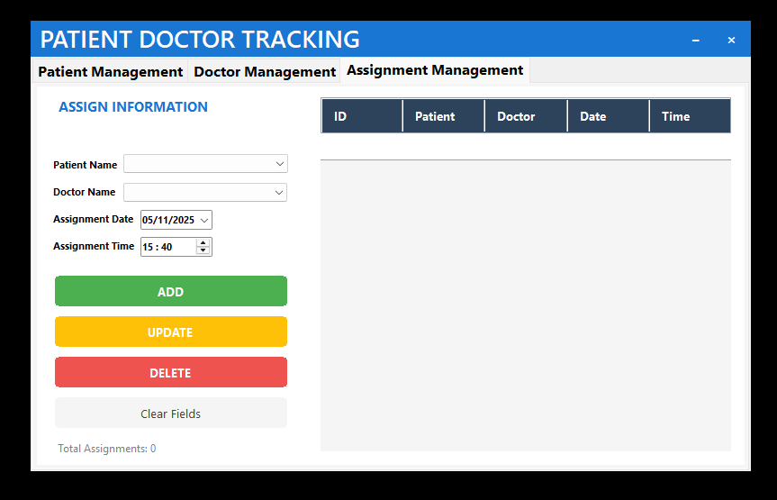

# Patient Doctor Tracking System

managing patients doctors and appointments.

### Requirements
- SQL Server
- .NET Framework 4.8

### Running the Application
1. Run SQL script
2. Edit exe.cfg with your sql connection
3. Run executable
