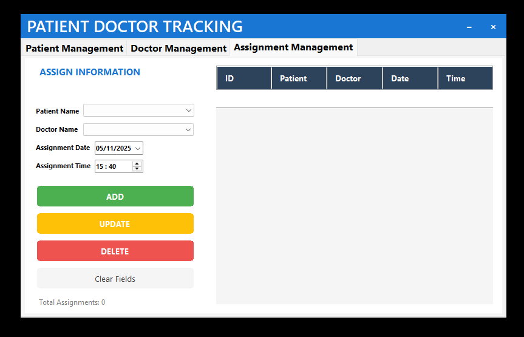

# Patient Doctor Tracking System

Windows Forms application for managing patient-doctor relationships and appointments.

## Setup

### Requirements
- Windows OS
- Visual Studio 2019+
- SQL Server Express
- .NET Framework 4.8

### Running the Application
1. Run SQL script
2. Edit exe.cfg
3. Run executable
